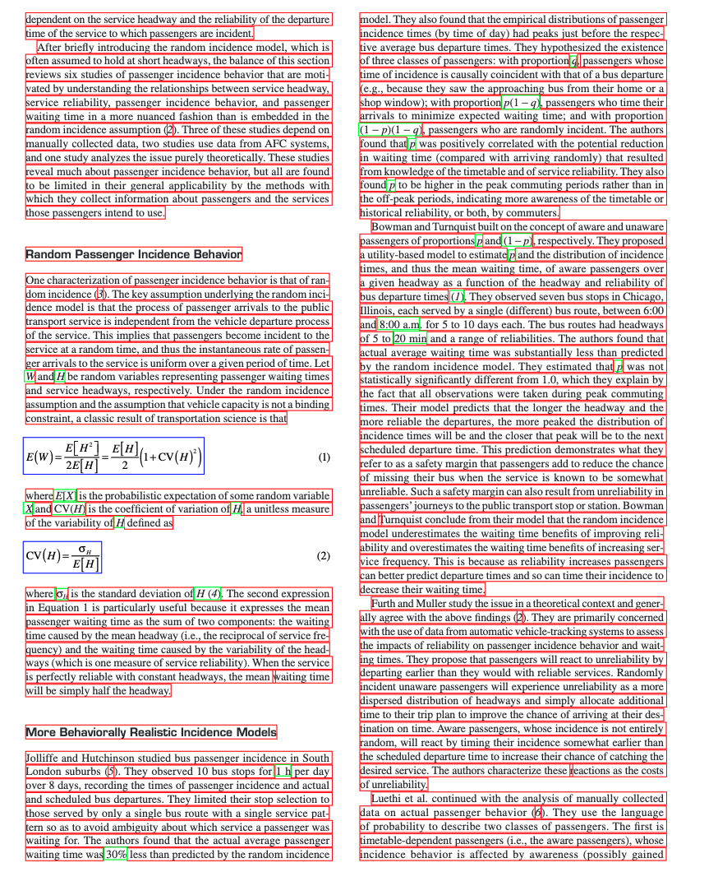
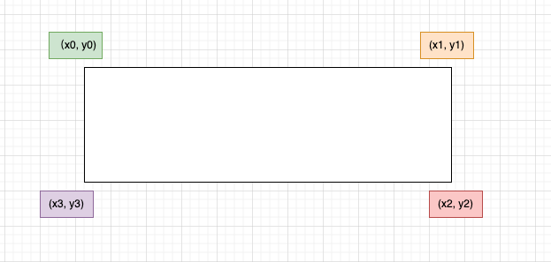

## 概览

`mineru` 命令执行后除了输出 markdown 文件以外，还可能会生成若干个和 markdown 无关的文件。现在将一一介绍这些文件

### some_pdf_layout.pdf

每一页的 layout 均由一个或多个框组成。 每个框右上角的数字表明它们的阅读顺序。此外 layout.pdf 框内用不同的背景色块圈定不同的内容块。


### some_pdf_spans.pdf(仅适用于pipeline后端)

根据 span 类型的不同，采用不同颜色线框绘制页面上所有 span。该文件可以用于质检，可以快速排查出文本丢失、行内公式未识别等问题。



### some_pdf_model.json(仅适用于pipeline后端)

#### 结构定义

```python
from pydantic import BaseModel, Field
from enum import IntEnum

class CategoryType(IntEnum):
     title = 0               # 标题
     plain_text = 1          # 文本
     abandon = 2             # 包括页眉页脚页码和页面注释
     figure = 3              # 图片
     figure_caption = 4      # 图片描述
     table = 5               # 表格
     table_caption = 6       # 表格描述
     table_footnote = 7      # 表格注释
     isolate_formula = 8     # 行间公式
     formula_caption = 9     # 行间公式的标号

     embedding = 13          # 行内公式
     isolated = 14           # 行间公式
     text = 15               # ocr 识别结果


class PageInfo(BaseModel):
    page_no: int = Field(description="页码序号，第一页的序号是 0", ge=0)
    height: int = Field(description="页面高度", gt=0)
    width: int = Field(description="页面宽度", ge=0)

class ObjectInferenceResult(BaseModel):
    category_id: CategoryType = Field(description="类别", ge=0)
    poly: list[float] = Field(description="四边形坐标, 分别是 左上，右上，右下，左下 四点的坐标")
    score: float = Field(description="推理结果的置信度")
    latex: str | None = Field(description="latex 解析结果", default=None)
    html: str | None = Field(description="html 解析结果", default=None)

class PageInferenceResults(BaseModel):
     layout_dets: list[ObjectInferenceResult] = Field(description="页面识别结果", ge=0)
     page_info: PageInfo = Field(description="页面元信息")


# 所有页面的推理结果按照页码顺序依次放到列表中即为 minerU 推理结果
inference_result: list[PageInferenceResults] = []

```

poly 坐标的格式 \[x0, y0, x1, y1, x2, y2, x3, y3\], 分别表示左上、右上、右下、左下四点的坐标


#### 示例数据

```json
[
    {
        "layout_dets": [
            {
                "category_id": 2,
                "poly": [
                    99.1906967163086,
                    100.3119125366211,
                    730.3707885742188,
                    100.3119125366211,
                    730.3707885742188,
                    245.81326293945312,
                    99.1906967163086,
                    245.81326293945312
                ],
                "score": 0.9999997615814209
            }
        ],
        "page_info": {
            "page_no": 0,
            "height": 2339,
            "width": 1654
        }
    },
    {
        "layout_dets": [
            {
                "category_id": 5,
                "poly": [
                    99.13092803955078,
                    2210.680419921875,
                    497.3183898925781,
                    2210.680419921875,
                    497.3183898925781,
                    2264.78076171875,
                    99.13092803955078,
                    2264.78076171875
                ],
                "score": 0.9999997019767761
            }
        ],
        "page_info": {
            "page_no": 1,
            "height": 2339,
            "width": 1654
        }
    }
]
```

### some_pdf_model_output.txt(仅适用于vlm后端)

该文件是vlm模型的输出结果，使用`----`分割每一页的输出结果。  
每一页的输出结果一些以`<|box_start|>`开头，`<|md_end|>`结尾的文本块。  
其中字段的含义：  
- `<|box_start|>x0 y0 x1 y1<|box_end|>`  
    其中x0 y0 x1 y1是四边形的坐标，分别表示左上、右下的两点坐标，值为将页面缩放至1000x1000后，四边形的坐标值。
- `<|ref_start|>type<|ref_end|>`  
  type是该block的类型，可能的值有：
  ```json
  {
      "text": "文本",
      "title": "标题",
      "image": "图片",
      "image_caption": "图片描述",
      "image_footnote": "图片脚注",
      "table": "表格",
      "table_caption": "表格描述",
      "table_footnote": "表格脚注",
      "equation": "行间公式"
  }
  ```
- `<|md_start|>markdown内容<|md_end|>`  
    该字段是该block的markdown内容，如type为text，文本末尾可能存在`<|txt_contd|>`标记，表示该文本块可以后后续text块连接。
    如type为table，内容为`otsl`格式表示的表格内容，需要转换为html格式才能在markdown中渲染。

### some_pdf_middle.json

| 字段名            | 解释                                        |
|:---------------|:------------------------------------------|
| pdf_info       | list，每个元素都是一个dict,这个dict是每一页pdf的解析结果，详见下表 |
| \_backend      | pipeline \| vlm，用来标识本次解析的中间态使用的模式         |
| \_version_name | string, 表示本次解析使用的 mineru 的版本号             |

<br>

**pdf_info**
字段结构说明

| 字段名              | 解释                                                                 |
| :------------------ | :------------------------------------------------------------------- |
| preproc_blocks      | pdf预处理后，未分段的中间结果                                        |
| layout_bboxes       | 布局分割的结果，含有布局的方向（垂直、水平），和bbox，按阅读顺序排序 |
| page_idx            | 页码，从0开始                                                        |
| page_size           | 页面的宽度和高度                                                     |
| \_layout_tree       | 布局树状结构                                                         |
| images              | list，每个元素是一个dict，每个dict表示一个img_block                  |
| tables              | list，每个元素是一个dict，每个dict表示一个table_block                |
| interline_equations | list，每个元素是一个dict，每个dict表示一个interline_equation_block   |
| discarded_blocks    | List, 模型返回的需要drop的block信息                                  |
| para_blocks         | 将preproc_blocks进行分段之后的结果                                   |

上表中 `para_blocks` 是个dict的数组，每个dict是一个block结构，block最多支持一次嵌套

<br>

**block**

外层block被称为一级block，一级block中的字段包括

| 字段名 | 解释                                            |
| :----- | :---------------------------------------------- |
| type   | block类型（table\|image）                       |
| bbox   | block矩形框坐标                                 |
| blocks | list，里面的每个元素都是一个dict格式的二级block |

<br>
一级block只有"table"和"image"两种类型，其余block均为二级block

二级block中的字段包括

| 字段名 | 解释                                                         |
| :----- | :----------------------------------------------------------- |
| type   | block类型                                                    |
| bbox   | block矩形框坐标                                              |
| lines  | list，每个元素都是一个dict表示的line，用来描述一行信息的构成 |

二级block的类型详解

| type               | desc           |
| :----------------- | :------------- |
| image_body         | 图像的本体     |
| image_caption      | 图像的描述文本 |
| image_footnote     | 图像的脚注   |
| table_body         | 表格本体    |
| table_caption      | 表格的描述文本 |
| table_footnote     | 表格的脚注   |
| text               | 文本块     |
| title              | 标题块     |
| index              | 目录块     |
| list               | 列表块     |
| interline_equation | 行间公式块   |

<br>

**line**

line 的 字段格式如下

| 字段名 | 解释                                                                 |
| :----- | :------------------------------------------------------------------- |
| bbox   | line的矩形框坐标                                                     |
| spans  | list，每个元素都是一个dict表示的span，用来描述一个最小组成单元的构成 |

<br>

**span**

| 字段名              | 解释                                                                             |
| :------------------ | :------------------------------------------------------------------------------- |
| bbox                | span的矩形框坐标                                                                 |
| type                | span的类型                                                                       |
| content \| img_path | 文本类型的span使用content，图表类使用img_path 用来存储实际的文本或者截图路径信息 |

span 的类型有如下几种

| type               | desc     |
| :----------------- | :------- |
| image              | 图片     |
| table              | 表格     |
| text               | 文本     |
| inline_equation    | 行内公式 |
| interline_equation | 行间公式 |

**总结**

span是所有元素的最小存储单元

para_blocks内存储的元素为区块信息

区块结构为

一级block(如有)->二级block->line->span

#### 示例数据

```json
{
    "pdf_info": [
        {
            "preproc_blocks": [
                {
                    "type": "text",
                    "bbox": [
                        52,
                        61.956024169921875,
                        294,
                        82.99800872802734
                    ],
                    "lines": [
                        {
                            "bbox": [
                                52,
                                61.956024169921875,
                                294,
                                72.0000228881836
                            ],
                            "spans": [
                                {
                                    "bbox": [
                                        54.0,
                                        61.956024169921875,
                                        296.2261657714844,
                                        72.0000228881836
                                    ],
                                    "content": "dependent on the service headway and the reliability of the departure ",
                                    "type": "text",
                                    "score": 1.0
                                }
                            ]
                        }
                    ]
                }
            ],
            "layout_bboxes": [
                {
                    "layout_bbox": [
                        52,
                        61,
                        294,
                        731
                    ],
                    "layout_label": "V",
                    "sub_layout": []
                }
            ],
            "page_idx": 0,
            "page_size": [
                612.0,
                792.0
            ],
            "_layout_tree": [],
            "images": [],
            "tables": [],
            "interline_equations": [],
            "discarded_blocks": [],
            "para_blocks": [
                {
                    "type": "text",
                    "bbox": [
                        52,
                        61.956024169921875,
                        294,
                        82.99800872802734
                    ],
                    "lines": [
                        {
                            "bbox": [
                                52,
                                61.956024169921875,
                                294,
                                72.0000228881836
                            ],
                            "spans": [
                                {
                                    "bbox": [
                                        54.0,
                                        61.956024169921875,
                                        296.2261657714844,
                                        72.0000228881836
                                    ],
                                    "content": "dependent on the service headway and the reliability of the departure ",
                                    "type": "text",
                                    "score": 1.0
                                }
                            ]
                        }
                    ]
                }
            ]
        }
    ],
    "_backend": "pipeline",
    "_version_name": "0.6.1"
}
```

### some_pdf_content_list.json

该文件是一个json数组，每个元素是一个dict，按阅读顺序平铺存储文档中所有可阅读的内容块。  
content_list可以看成简化后的middle.json，内容块的类型基本和middle.json一致，但不包含布局信息。  
content的类型有如下几种：

| type     | desc  |
|:---------|:------|
| image    | 图片    |
| table    | 表格    |
| text     | 文本/标题 |
| equation | 行间公式  |

需要注意的是，content_list中的title和text块统一使用text类型表示，通过`text_level`字段来区分文本块的层级，不含`text_level`字段或`text_level`为0的文本块表示正文文本，`text_level`为1的文本块表示一级标题，`text_level`为2的文本块表示二级标题，以此类推。  
每个content包含`page_idx`字段，表示该内容块所在的页码，从0开始。

#### 示例数据

```json
[
        {
        "type": "text",
        "text": "The response of flow duration curves to afforestation ",
        "text_level": 1,
        "page_idx": 0
    },
    {
        "type": "text",
        "text": "Received 1 October 2003; revised 22 December 2004; accepted 3 January 2005 ",
        "page_idx": 0
    },
    {
        "type": "text",
        "text": "Abstract ",
        "text_level": 2,
        "page_idx": 0
    },
    {
        "type": "text",
        "text": "The hydrologic effect of replacing pasture or other short crops with trees is reasonably well understood on a mean annual basis. The impact on flow regime, as described by the annual flow duration curve (FDC) is less certain. A method to assess the impact of plantation establishment on FDCs was developed. The starting point for the analyses was the assumption that rainfall and vegetation age are the principal drivers of evapotranspiration. A key objective was to remove the variability in the rainfall signal, leaving changes in streamflow solely attributable to the evapotranspiration of the plantation. A method was developed to (1) fit a model to the observed annual time series of FDC percentiles; i.e. 10th percentile for each year of record with annual rainfall and plantation age as parameters, (2) replace the annual rainfall variation with the long term mean to obtain climate adjusted FDCs, and (3) quantify changes in FDC percentiles as plantations age. Data from 10 catchments from Australia, South Africa and New Zealand were used. The model was able to represent flow variation for the majority of percentiles at eight of the 10 catchments, particularly for the 10–50th percentiles. The adjusted FDCs revealed variable patterns in flow reductions with two types of responses (groups) being identified. Group 1 catchments show a substantial increase in the number of zero flow days, with low flows being more affected than high flows. Group 2 catchments show a more uniform reduction in flows across all percentiles. The differences may be partly explained by storage characteristics. The modelled flow reductions were in accord with published results of paired catchment experiments. An additional analysis was performed to characterise the impact of afforestation on the number of zero flow days $( N _ { \\mathrm { z e r o } } )$ for the catchments in group 1. This model performed particularly well, and when adjusted for climate, indicated a significant increase in $N _ { \\mathrm { z e r o } }$ . The zero flow day method could be used to determine change in the occurrence of any given flow in response to afforestation. The methods used in this study proved satisfactory in removing the rainfall variability, and have added useful insight into the hydrologic impacts of plantation establishment. This approach provides a methodology for understanding catchment response to afforestation, where paired catchment data is not available. ",
        "page_idx": 0
    },
    {
        "type": "text",
        "text": "1. Introduction ",
        "text_level": 2,
        "page_idx": 1
    },
    {
        "type": "image",
        "img_path": "images/a8ecda1c69b27e4f79fce1589175a9d721cbdc1cf78b4cc06a015f3746f6b9d8.jpg",
        "img_caption": [
            "Fig. 1. Annual flow duration curves of daily flows from Pine Creek, Australia, 1989–2000. "
        ],
        "img_footnote": [],
        "page_idx": 1
    },
    {
        "type": "equation",
        "img_path": "images/181ea56ef185060d04bf4e274685f3e072e922e7b839f093d482c29bf89b71e8.jpg",
        "text": "$$\nQ _ { \\% } = f ( P ) + g ( T )\n$$",
        "text_format": "latex",
        "page_idx": 2
    },
    {
        "type": "table",
        "img_path": "images/e3cb413394a475e555807ffdad913435940ec637873d673ee1b039e3bc3496d0.jpg",
        "table_caption": [
            "Table 2 Significance of the rainfall and time terms "
        ],
        "table_footnote": [
            "indicates that the rainfall term was significant at the $5 \\%$ level, $T$ indicates that the time term was significant at the $5 \\%$ level, \\* represents significance at the $10 \\%$ level, and na denotes too few data points for meaningful analysis. "
        ],
        "table_body": "<html><body><table><tr><td rowspan=\"2\">Site</td><td colspan=\"10\">Percentile</td></tr><tr><td>10</td><td>20</td><td>30</td><td>40</td><td>50</td><td>60</td><td>70</td><td>80</td><td>90</td><td>100</td></tr><tr><td>Traralgon Ck</td><td>P</td><td>P,*</td><td>P</td><td>P</td><td>P,</td><td>P,</td><td>P,</td><td>P,</td><td>P</td><td>P</td></tr><tr><td>Redhill</td><td>P,T</td><td>P,T</td><td>，*</td><td>**</td><td>P.T</td><td>P,*</td><td>P*</td><td>P*</td><td>*</td><td>，*</td></tr><tr><td>Pine Ck</td><td></td><td>P,T</td><td>P,T</td><td>P,T</td><td>P,T</td><td>T</td><td>T</td><td>T</td><td>na</td><td>na</td></tr><tr><td>Stewarts Ck 5</td><td>P,T</td><td>P,T</td><td>P,T</td><td>P,T</td><td>P.T</td><td>P.T</td><td>P,T</td><td>na</td><td>na</td><td>na</td></tr><tr><td>Glendhu 2</td><td>P</td><td>P,T</td><td>P,*</td><td>P,T</td><td>P.T</td><td>P,ns</td><td>P,T</td><td>P,T</td><td>P,T</td><td>P,T</td></tr><tr><td>Cathedral Peak 2</td><td>P,T</td><td>P,T</td><td>P,T</td><td>P,T</td><td>P,T</td><td>*,T</td><td>P,T</td><td>P,T</td><td>P,T</td><td>T</td></tr><tr><td>Cathedral Peak 3</td><td>P.T</td><td>P.T</td><td>P,T</td><td>P,T</td><td>P,T</td><td>T</td><td>P,T</td><td>P,T</td><td>P,T</td><td>T</td></tr><tr><td>Lambrechtsbos A</td><td>P,T</td><td>P</td><td>P</td><td>P,T</td><td>*,T</td><td>*,T</td><td>*,T</td><td>*,T</td><td>*,T</td><td>T</td></tr><tr><td>Lambrechtsbos B</td><td>P,T</td><td>P,T</td><td>P,T</td><td>P,T</td><td>P,T</td><td>P,T</td><td>P,T</td><td>P,T</td><td>T</td><td>T</td></tr><tr><td>Biesievlei</td><td>P,T</td><td>P.T</td><td>P,T</td><td>P,T</td><td>*,T</td><td>*,T</td><td>T</td><td>T</td><td>P,T</td><td>P,T</td></tr></table></body></html>",
        "page_idx": 5
    }
]
```